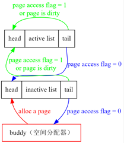
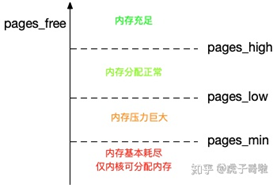

# Linux SWAP

## 1. 什么是SWAP？

我们一般所说的swap，指的是一个交换分区或文件。从功能上讲，SWAP主要用于在内存不够用的时候，将内存中的部分数据交换到swap空间里，以扩展系统可用的内存空间。

当内存使用存在压力，开始触发内存回收的行为时，就可能会使用swap空间。

内核对swap的使用实际上是跟**内存回收**行为紧密结合的。

> Linux中，用于文件Cache的内存不视为已使用，即这部分内存仍可以腾空来为用户提供服务。

## 2. 内存回收

回收内存的情况：

1. Linux内核使用cache的策略是不用白不用，所以内核会使用内存中的page cache对部分文件进行缓存，以便提升文件的读写效率。内核会**周期性回收内存**，以便让系统的内存处于充足的状态，从而应对各种突发情况。
2. 当真的有大于空闲内存的申请到来的时候，会触发**强制内存回收**。

内存回收的两种机制：

1. 使用**kswapd进程对内存进行周期检查**，以保证平常状态下剩余内存尽可能够用。
2. **直接内存回收**（directpagereclaim），当没有足够的空闲内存以满足内存分配时，触发直接内存回收。

这两个方法殊途同归，最终的逻辑都是一样的。

内存回收主要需要进行扫描的链表有如下4个：

- anon的inactive
- anon的active
- file的inactive
- file的active

就是说，内存回收操作主要针对的就是内存中的**文件页**（file  cache）和**匿名页**。

活跃（active）还是不活跃（inactive）的判断内核会使用lru算法进行处理并进行标记

回收过程主要是针对上面四条链表进行扫描和操作：

1. 内核会先扫描anon的active链表，将不频繁的放进inactive链表中，然后扫描inactive链表，将里面活跃的移回active中；
2. 进行swap的时候，先对inactive的页进行换出；
3. 如果是file的文件映射page页，则判断其是否为脏数据，如果是脏数据就写回，不是脏数据可以直接释

这样看来， 内存回收这个行为会对两种内存的使用进行回收:

- 一种是anon的匿名页内存，主要回收手段是swap；
- 另一种是file-backed的文件映射页，主要的释放手段是写回和清空。

因为针对filebased的内存，没必要进行交换，其数据原本就在硬盘上，回收这部分内存只要在有脏数据时写回，并清空内存就可以了，以后有需要再从对应的文件读回来。

## 3. 内存LRU链表扫描

内核回收内存时，会对LRU链表进行扫描，具体的逻辑如下：

首先，常规的LRU需要在每次访问页表时对链表进行调整，而内核使用的LRU链表只会**定期调整**链表。这依赖于内核的定期（或者说有间隔的）内存回收。

另外在Page的元数据中，还维护一个`PAGE_ACCESS_FLAG`，表示该Page是否被访问。

每次内存回收，后台线程会扫描active链表和inactive链表，并对链表进行调整。内存回收会涉及以下过程：

- active链表：依次从尾部取页表，若页表被访问/或者dirty，则放回active链表头部，否则放回inactive链表头部
- inactive链表：依次从尾部取页表，若页表被访问/或者dirty，则放回active链表头部，否则回收
- 将所有页表的PAGE_ACCESS_FLAG置为0
- Flush tlb，将PAGE_ACCESS_FLAG从1置为0的页表项从tlb中删除。

另外，对于内存分配，新分配的页表会放在inactive链表的头部。

## 4. swappiness 参数

有时我们桌面环境确实配置了比较充裕的内存，并且也配置了swap空间，这个时候就希望尽量减少swap空间的使用，避免对系统性能造成影响，Linux早就帮我们考虑到这种情况了，在2.6内核中，增加了一个叫做swappiness的参数，用于配置需要将内存中不常用的数据移到swap中去的紧迫程度。这个参数的取值范围是0～100，0告诉内核尽可能的不要将内存数据移到swap中，也即只有在迫不得已的情况下才这么做，而100告诉内核只要有可能，尽量的将内存中不常访问的数据移到swap中。

文件`/proc/sys/vm/swappiness`用于调整跟swap相关的参数，文件的默认值是60，取值范围是0-100。

这个文件的值用来定义内核使用swap的积极程度：

- 值越高，内核就会越积极的使用swap；
- 值越低，就会降低对swap的使用积极性。
- 如果这个值为0，那么内存**free和file-backed**使用的页面总量小于高水位标记（high water mark）之前，不会发生交换。

如何理解 `swappiness` 参数的含义呢？可以考以下两个问题：

1. 如果回收内存可以有两种途径（匿名页交换和file缓存清空），那么我应该考虑在本次回收的时候，什么情况下多进行file写回，什么情况下应该多进行swap交换。说白了就是**平衡两种回收手段的使用**，以达到最优。
2. 如果符合交换条件的内存较长，是不是可以不用全部交换出去？比如可以交换的内存有100M，但是目前只需要50M内存，实际只要交换50M就可以了，不用把能交换的都交换出去。也就是说需要一个策略来指示**每次交换的大小**，这个在后面的水位标记部分进行说明。

这个参数实际上是指导内核在清空内存的时候，是更倾向于清空file-backed内存还是更**倾向**于进行匿名页的交换的。当然，这只是个倾向性，是指在两个都够用的情况下，更愿意用哪个，如果不够用了，那么该交换还是要交换。

关于swappiness的使用策略具体如下：

1. 如果swappiness设置为100，那么匿名页和文件将用**同样的优先级**进行回收。
    很明显，使用**清空文件的方式将有利于减轻内存回收时可能造成的IO压力**。因为如果file-backed中的数据不是脏数据的话，那么可以不用写回，这样就没有IO发生，而一旦进行交换，就一定会造成IO。

    所以系统默认将swappiness的值设置为60，这样回收内存时，对file-backed的文件cache内存的清空比例会更大，内核将会更倾向于进行缓存清空而不是交换。

2. 这里的swappiness值如果是60，那么是不是说内核回收的时候，会按照60:140的比例去做相应的swap和清空file-backed的空间呢？并不是。在做这个比例计算的时候，内核还要参考当前内存使用的其他信息。具体如何自行了解。我们在此要明确的概念是： swappiness的值是用来控制内存回收时，回收的匿名页更多一些还是回收的file cache更多一些 。

3. swappiness设置为0的话，是不是内核就根本不会进行swap了呢？这个答案也是否定的。**首先是内存真的不够用的时候，该swap的话还是要swap**。

其次在内核中还有一个逻辑会导致直接使用swap，如果触发的是全局回收，并且zonefile + zonefree <= high_wmark_pages(zone)条件成立时，则一定会进行针对匿名页的swap操作。具体见后面的分析。

> 感觉这里可以设置两个参数，一个用于表示swap的积极程度，另一个用于表示swap的倾向度

## 5. 什么时候进行内存回收？

kswapd进程要周期对内存进行检测，达到一定阈值的时候开始进行内存回收。当剩余内存比较小的时候，就是内存压力较大的时候，就应该开始试图回收些内存了，这样才能保证系统尽可能的有足够的内存给突发的内存申请所使用。

### 5.1. 内存水位标记（watermark）

Linux内核使用水位标记（watermark）的概念，来描系统可用内存的情况。

Linux为内存的空闲情况设置了三种内存水位标记:high、low、min。他们所标记的含义分别为：

- 剩余内存在high以上表示内存剩余较多，目前内存使用压力不大；
- high-low的范围表示目前剩余内存存在一定压力；
- low-min表示内存开始有较大使用压力，剩余内存不多了；
- 小于min时，说明内存面临很大压力。此时内存保留给内核在特定情况下使用的，一般不会分配。

内存回收行为就是基于剩余内存的水位标记进行决策的：**当系统剩余内存低于watermark[low]的时候，内核的kswapd开始起作用，进行内存回收。直到剩余内存达到watermark[high]的时候停止。如果内存消耗导致剩余内存达到了或超过了watermark[min]时，就会触发直接回收（direct reclaim）。**

> 明白了水位标记的概念之后，zonefile + zonefree <= high_wmark_pages(zone)这个公式就能理解了。这里的zonefile相当于内存中文件映射的总量，zonefree相当于剩余内存的总量。
>
> 内核一般认为，如果zonefile还有的话，就可以尽量通过清空文件缓存获得部分内存，而不必只使用swap方式对anon的内存进行交换。
> 
> 整个判断的概念是说，在全局回收的状态下（有global_reclaim(sc)标记），如果当前的文件映射内存总量+剩余内存总量的值评估小于等于watermark[high]标记的时候，就可以进行直接swap了。
> 
> 这样是为了**防止进入cache陷阱**，具体描述可以见代码注释。
> 
> 这个判断对系统的影响是， swappiness设置为0时，有剩余内存的情况下也可能发生交换。

### 5.2. watermark相关值如何计算？

所有的内存watermark标记都是根据当前内存总大小和一个可调参数进行运算得来的，这个参数是： /proc/sys/vm/min_free_kbytes

- 首先这个参数本身决定了系统中每个zone的watermark[min]的值大小。
- 然后内核根据min的大小并参考每个zone的内存大小分别算出每个zone的low水位和high水位值。

想了解具体逻辑可以参见源代码目录下的该文件：mm/page_alloc.c

### 5.3. zone 分区

在系统中可以从/proc/zoneinfo文件中查看当前系统的相关的信息和使用情况。

我们会发现以上内存管理的相关逻辑都是以**zone**为单位的，这里zone的含义是指内存的分区管理。

Linux将内存分成多个区，主要有:

- 直接访问区(DMA)
- 一般区(Normal)
- 高端内存区(HighMemory)

内核对内存不同区域的访问**因为硬件结构因素会有寻址和效率上的差别**。**如果在NUMA架构上，不同CPU所管理的内存也是不同的zone**。

## 6. swap分区的优先级（priority）

在使用多个swap分区或者文件的时候，还有一个优先级的概念（Priority）。

在swapon的时候，我们可以使用-p参数指定相关swap空间的优先级， 值越大优先级越高 ，可以指定的数字范围是－1到32767。

内核在使用swap空间的时候总是**先使用优先级高的空间，后使用优先级低的**。

当然如果把多个swap空间的**优先级设置成一样**的，那么两个swap空间将会以**轮询**方式并行进行使用。

如果两个swap放在两个**不同的硬盘**上，相同的优先级可以起到类似RAID0的效果，**增大swap的读写效率**。

另外，编程时使用mlock()也可以将**指定的内存标记为不会换出**，具体帮助可以参考man 2 mlock。

## 7. SWAP的使用建议

关于swap的使用建议，针对不同负载状态的系统是不一样的。有时我们希望swap大一些，可以在内存不够用的时候不至于触发oom-killer导致某些关键进程被杀掉，比如数据库业务。

也有时候我们希望不要swap，因为当大量进程爆发增长导致内存爆掉之后，会因为swap导致IO跑死，整个系统都卡住，无法登录，无法处理。

这时候我们就希望不要swap，即使出现oom-killer也造成不了太大影响，但是不能允许服务器因为IO卡死像多米诺骨牌一样全部死机，而且无法登陆。跑cpu运算的无状态的apache就是类似这样的进程池架构的程序。

所以：

- swap到底怎么用?
- 要还是不要？
- 设置大还是小？
- 相关参数应该如何配置？
- 是要根据我们自己的生产环境的情况而定的。

阅读完本文后希望大家可以明白一些swap的深层次知识。

## 8. 对混合内存池设计的启发

混合内存池可以将AEP的使用分成两部分：（也可以划分更细）

- 用户数据
- 系统缓存

用户数据和系统缓存通过某种进行策略实现冷热管理（类似Linux SWAP的LRU链表，**实际可以使用冷热等级更多的链表进行管理，或者实现更细情况的状态机**）。

### 8.1. AEP空间回收积极度与倾向度

类似 `swappiness`。

通过分析回收用户数据和回收系统缓存对系统整体性能的影响，来设置一个合理的回收倾向度，以让系统更倾向于回收某一部分的空间。

这个倾向度实际上就是对我们划分的不同AEP部分进行一个**重要度分级**。

然后还可以设置一个积极度参数，用于指示每次AEP空间回收时swap操作的积极程度。

### 8.2. 可用内存警戒线

类似 `watermark`。

设置可用内存的不同程度阈值：

- high
- low
- min

按照某种策略（比如按照一定时间间隔扫描），使用后台线程回收AEP空间。

### 8.3. 其他策略

1. AEP 分区
2. SSD 分区

## 9. 参考

1. 重点参考：[Linux SWAP 深度解读](https://blog.csdn.net/huangyimo/article/details/80227991)
2. Linux swap分区(主要介绍怎么使用): <https://blog.csdn.net/qq_32095699/article/details/99232092>
3. linux kswapd浅析：<https://blog.csdn.net/prike/article/details/78905753>