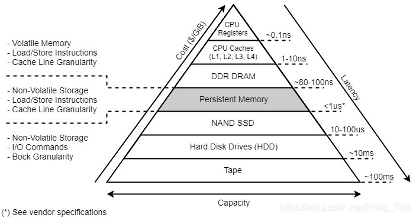

# PMDK 介绍

PMDK 的全称是 Persistent Memory Development Kit，它包含了 Intel 开发的一系列旨在方便非易失性内存的应用开发的函数库和工具。PMDK 是一个还在快速发展变化的新鲜事物。

## 库与工具

PMDK 的 Git 仓库包含了libpmem、libvmem、libpmemblk、libpmemlog、libpmemobj、libpmempool、libvmmalloc 等很多函数库。

还有很多函数库和工具分散在**其他的一些 Git 仓库**中，例如libpmemkind、libvmemcache、libpmemkv 以及支持 C/C++、Java、Python 等语言的绑定。

更详细的库情况，参考：<https://pmem.io/pmdk/>

Intel 把前面提到的很多函数库、工具等统称为 PMDK。可以推测，它在快速发展过程中会不断的增加新的成员，也可能会删除旧的成员。这些五花八门的函数库、工具、例子和文档正说明了 NVM 潜在应用范围之广泛，也证明了 Intel 在不遗余力的构建围绕 NVM 的软件生态。

这些库在Linux和Windows上进行了调优和验证，它们建立在直接访问（DAX）功能的基础上，该功能使应用程序可以直接访问持久性内存作为内存映射文件。图1显示了模型，该模型描述了当数据映射到应用程序时，应用程序如何使用传统的POSIX标准API（例如读，写，前置和pwrite）或加载/存储操作（例如memcpy）访问持久性存储设备（NVDIMM）。“**Persistent Memory**”区域描述了最快的访问速度，因为应用程序 I/O 绕过了现有文件系统页面缓存，并**直接与持久性存储介质进行通讯**。

<b>图1 SNIA编程模型</b>

**DAX（Direct Access）访问特性:**

用户态程序可以使用标准的文件系统API来操作NVM，同样也可以使用mmap将其直接映射到用户空间，无论使用哪种方式，对NVM的操作都会直接转换为对NVM的load和store，中间是**没有page cache**的。这就是支持DAX模式的文件系统和普通文件系统之间的一点区别。

直接访问物理介质会带来新的编程挑战和范例。PMDK为应用程序开发人员提供了许多下面突出显示的库和功能，以解决一些较困难的编程问题：

**可用库：**

- [**libpmem**](http://pmem.io/pmdk/libpmem/)**：** 提供低级别的持久内存支持
- [**libpmemobj**](http://pmem.io/pmdk/libpmemobj/)**：** 提供了一个事务对象存储，提供内存分配，事务和持久性存储器编程的一般设施。
- [**libpmemblk**](http://pmem.io/pmdk/libpmemblk/)**：** PMEM驻留的块，所有块具有相同的尺寸，被原子方式更新的支撑件阵列。
- [**libpmemlog**](http://pmem.io/pmdk/libpmemlog/)**：** 提供PMEM驻留日志文件。
- [**libvmem**](http://pmem.io/pmdk/libvmem/)**（已废弃）：** 原来的持久存储池到易失性内存池，类似于系统堆，但保持独立，并与自己的malloc风格的API。由于持久性内存支持已集成到[libmemkind中](https://github.com/memkind/memkind)，因此对于任何易失性实现，建议选择该库。 [Libmemkind将对](https://github.com/memkind/memkind)多种类型的易失性存储器的支持组合到一个便捷的API中。
- [**libvmmalloc**](http://pmem.io/pmdk/libvmmalloc/)**：** 库透明地将所有的动态内存分配到永久性的内存分配。
- [**libpmempool**](http://pmem.io/pmdk/libpmempool/)**：** 提供离线池管理和诊断支持。
- [**librmem**](http://pmem.io/pmdk/librpmem/)**：** 提供了一种用于一种利用能进行RDMA的RNICs持久性存储器的远程访问底层支持。
- [**libvmemcache**](https://github.com/pmem/vmemcache)**：**是一个可嵌入和轻质的内存的缓存解决方案。它旨在以有效且可扩展的方式通过内存映射来充分利用大容量内存，例如具有DAX的持久性内存。

**可用的实用程序**：

- [**pmempool**](http://pmem.io/pmdk/pmempool/)**：**管理和分析持久内存池这个独立的实用程序
- [**pmemcheck**](http://pmem.io/2015/07/17/pmemcheck-basic.html)**：**使用动态运行分析Valgrind的用于与持久性存储器使用的增强版本。

## 存储层次结构

除了内存和存储层之外，持久性存储层还提供了比DRAM更大的容量，并且比存储还快得多的性能。应用程序可以像访问传统内存一样就地访问持久性内存驻留数据结构，从而无需在内存和存储之间来回分页数据块。

<b>图2 具有持久内存的存储层次结构</b>

## I/O 机制

libpmem库主要特性是提供一种将脏数据刷写到持久内存的方法。常用的函数主要包括pmem_flush、pmem_drain、pmem_memcpy_nodrain。由于CPU CACHE内容向PM刷写的时机和顺序不受用户控制，所以需要特定指令进行强制刷写。pmem_flush的功能为调用CLWB、CLFLUSHOPT或CLFLUSH指令强制将CPU CACHE中内容（以cache line为单位）刷写到PM；指令发起后，由于CPU是多核，cache中内容到PM的顺序也不一样，所以还需要pmem_drain即调用SFENCE指令，确保CLWBs全部执行完成。如果pmem_flush调用的指令是CLFLUSH，则该指令中包含sfence，所以理论上不再需要调用pmem_drain，实际上如果是这个指令的话，pmem_drain什么也不做。

  上述讲述了CPU cache内容向PM刷写的函数。下面讲述内存拷贝，即从内存向PM拷贝数据。该功能由pmem_memcpy_nodrain完成，调用MOVNT指令（MOV或MOVNTDQ），该指令拷贝不经过CPU CACHE，所以这个功能不需要flush。但是需要在结束的时候建立sfence确保所有数据都已经拷贝到PM。

## 更多

1. 编程简介与英特尔永久记忆：< https://software.intel.com/en-us/articles/introduction-to-programming-with-persistent-memory-from-intel>
2. 持久内存开发套件的库总览：<https://rtoax.blog.csdn.net/article/details/109694310>
3. PMDK(NVML)事务实现机制源码分析：<https://blog.csdn.net/weixin_33682719/article/details/92562281>
4. PMDK（Persistent Memory Development Kit）及其应用场景：<https://zhuanlan.zhihu.com/p/69345874>

## 参考

1. 重点参考：[PMDK介绍](https://rtoax.blog.csdn.net/article/details/109694491)
2. 