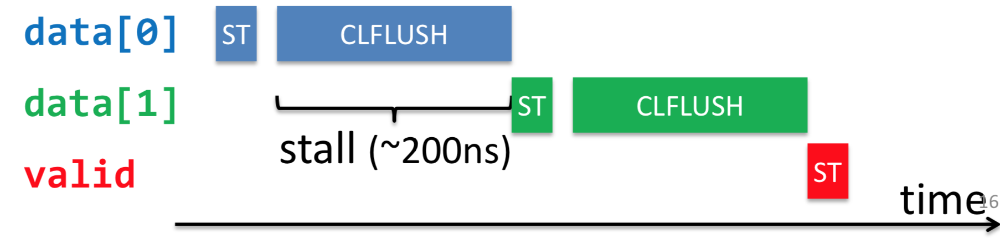
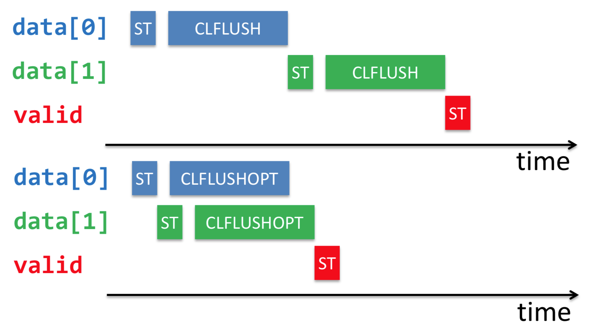
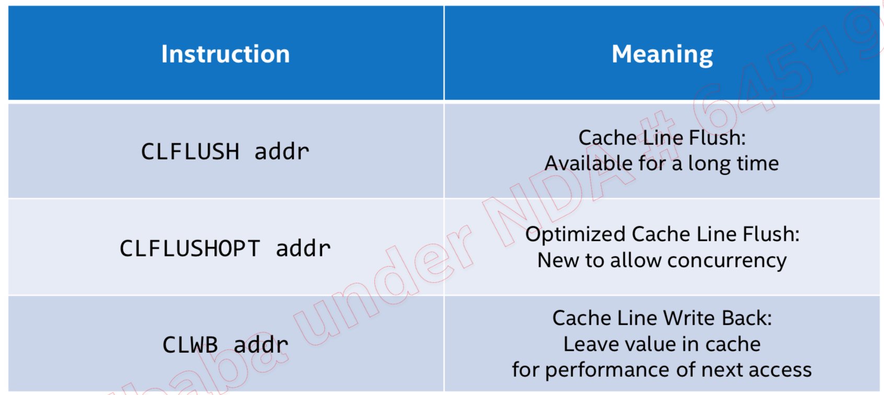
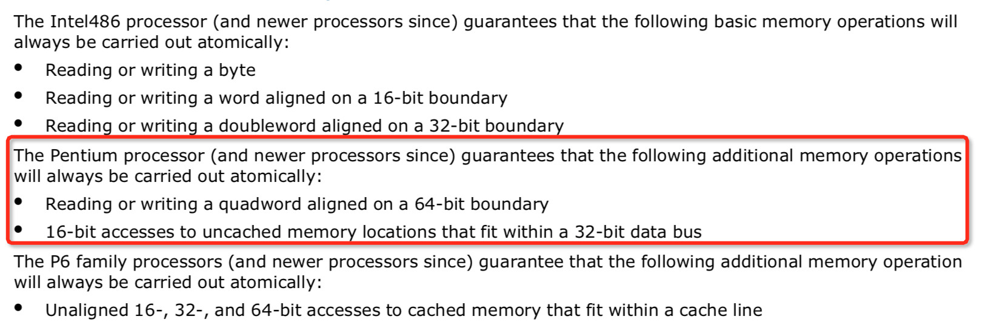
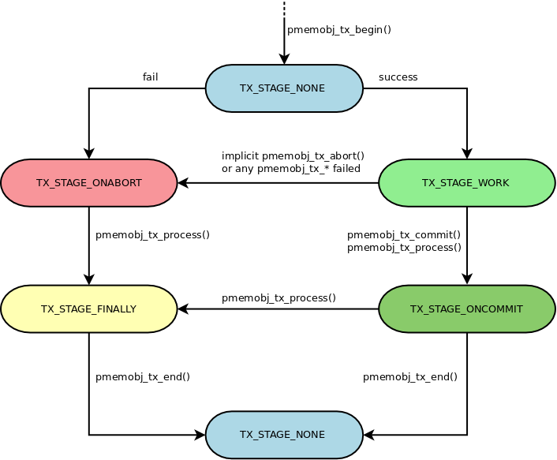

# PMDK 使用

参考：[PMDK(NVML)事务实现机制源码分析](https://my.oschina.net/fileoptions/blog/1629405)

NVM（NON-VOLATILE MEMORY）存储可以使用使能DAX功能的文件系统直接暴露在用户空间，用户态程序可以使用**标准的文件系统API**来操作NVM，同样也可以使用**mmap**将其直接映射到用户空间，无论使用哪种方式，对NVM的操作都会直接转换为对NVM的load和store，中间是**没有page cache**的（这就是支持DAX模式的文件系统和普通文件系统之间的一点区别）

在使用文件系统时，数据的完整性一般都由文件系统来保证，而NVM作为一种非易失性存储，**在使用mmap方式来读写时，如何保证数据的完整性和一致性就显得尤为重要**。

实现数据完整性和一致性方法：

- 上层应用程序自己设计策略来保证
- 使用第三方库来做，如 pmdk 中的 [libpmemobj](https://pmem.io/pmdk/libpmemobj/)。

## 内存池(Memory pools)的一些概念

### 持久化原理

```cpp
/*
 * pmem_persist -- make any cached changes to a range of pmem persistent
 */
void
pmem_persist(const void *addr, size_t len)
{
	LOG(15, "addr %p len %zu", addr, len);
   // 将缓冲区中的内容刷新到NVM中
	pmem_flush(addr, len);
   // 等待排空缓冲区，本质是一个存储内存屏障，实际可以理解为一个写屏障
	pmem_drain();
}
```

其中`pmem_flush`可能使用的指令有：

- CLFLUSH
- CLFLUSHOPT
- CLWB

最开始，intel只支持CLFLUSH缓存指令，CLFLUSH的特点是顺序化、串行化的刷新缓存，其缺点是会导致cpu的流水线出现较大的stall时间，导致性能较差：



后来针对NVM加入了CLFLUSHOPT优化指令，他们之间的区别如下图所示：



可见，CLFLUSHOPT就是相当于无序版本的CLFLUSH，性能自然会高很多。由于CLFLUSHOPT不在保证顺序顺序，因此对于上面的代码，需要在为valid置1之前加一个内存屏障，保证之前的CLFLUSHOPT操作全部完成（前文所说的pmem_drain就是完成这个功能）

CLWB和CLFLUSHOPT完成的功能类似，唯一不同的是，CLWB在把缓存中的数据刷新之后，并不会失效它， 因此后续的读还是可以读到缓存中的数据，因此性能会好一些。下面总结一下他们之间的区别：



### 持久指针(Persistent pointers)

在pmdk中，持久化指针占用两个64 bit，定义如下：

```cpp
typedef struct pmemoid {
	uint64_t pool_uuid_lo;// 每一个pool都有一个uuid唯一标识自己
	uint64_t off;// 对象在该pool中的偏移量
} PMEMoid;
```

从`PMEMoid`转换为直接指针（direct pointer）的原理是：`(void *)((uint64_t)pool + oid.off)`。

```cpp
/*
 * pmemobj_direct -- returns the direct pointer of an object
 */
void *
pmemobj_direct(PMEMoid oid)
{
	return pmemobj_direct_inline(oid);
}

/*
 * Returns the direct pointer of an object.
 */
static inline void *
pmemobj_direct_inline(PMEMoid oid)
{
	if (oid.off == 0 || oid.pool_uuid_lo == 0)
		return NULL;
    // _pobj_cached_pool是线程局部存储的obj缓存
	struct _pobj_pcache *cache = &_pobj_cached_pool;

    // _pobj_cache_invalidate会在每次pmemobj_close被调用的时候加1
    // 也就说，如果在本次转换之前，有pool被close了，那么就让缓存失效，需要重新查找
    // 否则，即使缓存有效，但是uuid和缓存的没有匹配，那么也要重新查找
	if (_pobj_cache_invalidate != cache->invalidate ||
			cache->uuid_lo != oid.pool_uuid_lo) {
       // 更新缓存技术
		cache->invalidate = _pobj_cache_invalidate;
       // 根据oid的uuid去cuckoo hash table中查找
		if (!(cache->pop = pmemobj_pool_by_oid(oid))) {
			cache->uuid_lo = 0;
			return NULL;
		}
       // 更新到cache中
		cache->uuid_lo = oid.pool_uuid_lo;
	}
    // 计算直接指针
	return (void *)((uintptr_t)cache->pop + oid.off);
}
```

pool的ID和obj会进行cache。通过一个hash管理id到obj的映射。

### 根对象(The root object)

PMDK为了管理Pool中的对象而衍生出来的概念。类比于我们在常规编程中，需要先定义一个变量，然后使用这个变量来找到它占用的那块内存。

可以将你自己定义的数据结构依附在这个根对象上，要分配一个根对象可以直接使用pmemobj_root接口，类似如：

```cpp
PMEMoid root = pmemobj_root(pop, sizeof (struct my_root));
```

pop是我们使用前文所述方式创建的PMEMobjpool指针，my_root是我们自己定义的数据结构，返回值就是持久指针。

需要注意的是，pmemobj_root分配的对象内存已经自动被初始化为0，如果你想重新调整对象的大小，只需要改变size参数就好了，如果使用新的size无法完成就地分配（即使用太大size，无法本地分配那么多连续的空间），那么一个新的对象将被创建，因此它在pool中的偏移也将被改变，所以，**千万不要在使用过程中把持久指针保存在任何地方，因为它是可变的**。

## 安全存储数据（完整性，一致性）

假设根对象my_root的定义如下：

```cpp
struct my_root {
	char name[MAX_BUF_LEN];
};
```

然后我们使用如下函数向根对象写入数据：

```cpp
void set_name(const char *my_name) {
   memcpy(root->name, my_name, strlen(my_name));
}
```

如果是在易失性存储上，上面的代码不会有什么问题。但是如果在持久型存储上，上面的代码结果是不确定的。因为程序会crash，机器也可能掉电关机，这些导致程序非正常退出的因素都可能导致上述的数据写入出现不一致的状态：

1. 程序在数据拷贝之前（memcpy执行之前）crash掉了，实际存储仍为0。
2. 数据拷贝到一半的时候crash掉了，假设my_name为“Brianna”，实际存储了的可能为“Brian”
3. 假设memcpy完成后才crash，由于cpu cache刷新的顺序的不确定性，可能会导致“anna”先被刷新，而位于另一个cache line上的“Bri”却还没来得及被刷新。

那我们如何保证数据的完整性呢?

### 事务实现方式--应用程序自己保证

现在我们调整一下我们定义的数据结构，加入一个长度字段，如下：

```cpp
struct my_root {
	size_t length;
	char name[MAX_BUF_LEN];
};
```

然后将存储函数实现为：

```cpp
void set_name(const char *my_name) {
   root->length = strlen(my_name);
   pmemobj_persist(&root->length, sizeof (root->length));
   pmemobj_memcpy_persist(root->name, my_name, root->length);
}
```

在pmdk中，**所有以_persist结尾的接口都会确保它们所操作的内存都会从cpu cache中刷新到NVM中**。所以，在上面的set_name函数中，一旦程序执行到第5行，我们就可以完全确认root->length里面已经存储了长度信息（并且已经完整的持久化了）。因此，在我们对内存进行读之前，可以用长度字段对后面的数据进行完整性校验。

需要注意的是，在当前的硬件架构中，**只有8字节的内存可以被以原子方式的写**（意思是要么8字节全部写成功，要么写失败）。



所以，下面的代码是正确的：

```cpp
root->u64var = 123;
pmemobj_persist(&root->u64var, 8);
```

但是下面这种就是错误的（有可能在出现异常的时候只写了前8个字节）：

```cpp
root->u64var = 123;
root->u32var = 321;
pmemobj_persist(&root->u64var, 12);
```

### 事务实现方式--PMDK事务接口

前文中，我们用自己的方式（比如数据前加一个长度字段）实现了写的事务性，但是pmdk为我们提供了更为简单的实现方式，这就是事务（transactions）。在pmdk中，事务操作都是使用以pmemobj_tx_前缀开始的接口完成的，一个事务是分阶段执行的，各阶段具体定义在pobj_tx_stage枚举中：

```cpp
/*
 * Transactions
 *
 * Stages are changed only by the pmemobj_tx_* functions, each transition
 * to the TX_STAGE_ONABORT is followed by a longjmp to the jmp_buf provided in
 * the pmemobj_tx_begin function.
 */
enum pobj_tx_stage {
	TX_STAGE_NONE,		/* no transaction in this thread */
	TX_STAGE_WORK,		/* transaction in progress */
	TX_STAGE_ONCOMMIT,/* successfully committed */
	TX_STAGE_ONABORT,	/* tx_begin failed or transaction aborted */
	TX_STAGE_FINALLY,	/* always called */

	MAX_TX_STAGE
};
```



```cpp
/* TX_STAGE_NONE */

TX_BEGIN(pop) {
	/* TX_STAGE_WORK */
} TX_ONCOMMIT {
	/* TX_STAGE_ONCOMMIT */
} TX_ONABORT {
	/* TX_STAGE_ONABORT */
} TX_FINALLY {
	/* TX_STAGE_FINALLY */
} TX_END

/* TX_STAGE_NONE */
```

上面的代码中，除了TX_BEGIN和TX_END是必须的之外，其他的阶段都是可选的。不仅如此，这种写法也是支持嵌套事务的（理论上嵌套事务层数不受限制），一旦嵌套的事务执行失败，那么整个事务就执行失败。  

下面举个例子：

```cpp
void do_work() {
	struct my_task *task = malloc(sizeof *task);
	if (task == NULL) return;

	TX_BEGIN(pop) {
		/* important work */
		pmemobj_tx_abort(-1);
	} TX_END

	free(task);
}

...
TX_BEGIN(pop)
	do_work();
TX_END
```

上面的代码片段中，一个外层事务（根事务）包含了一个嵌套事务（子事务），这段代码看上去是很简单、没什么问题的。但是，**这段代码是存在内存泄露的，原因是，pmdk的事务是基于setjmp和longjmp来做的（在事务开始的时候setjmp，在事务abort的时候longjmp），因此你没办法保证在嵌套事务中位于TX_END后面的代码一定会被执行**。比如上述的代码中，free操作就不会被执行，因为一旦执行到pmemobj_tx_abort，事务就会longjmp到嵌套事务的开始处。因此，正确的写法应该如下：

```cpp
void do_work() {
    // 注意这里的volatile
	volatile struct my_task *task = NULL;

	TX_BEGIN(pop) {
		task = malloc(sizeof *task);
		if (task == NULL) pmemobj_tx_abort(ENOMEM);

		/* important work */
		pmemobj_tx_abort(-1);
	} TX_FINALLY {
		free(task);
	} TX_END
}
```

熟悉java异常处理的都应该对上面的代码很熟悉，它就相当于`try{}cache{}finally{}`，同时，还要注意上面的volatile关键字，因为一个局部变量，在setjmp之后值很可能会被改变的（比如在TX_STAGE_WORK阶段），如果不加volatile修饰，那么在longjmp之后这个变量的值很可能不被观察到，**因此，凡是会被用在TX_STAGE_ONABORT/TX_STAGE_FINALLY阶段的局部变量，建议都要加上volatile修饰**。

## 事务操作

pmdk将事务分为三种基本操作：

- 分配（allocation）
- 释放（free）
- 设置（set）

先介绍set的事务操作，该操作用来安全可靠的将一段内存设置为某一个值。基本原理是：**pmdk会先将要操作的内存的一个快照（snapshot）保存在undo log中，之后应用程序可以随意修改原来的那块内存，过程中一旦出现任何失败，所有的操作就被回滚**。

并且需要注意的是，pmdk会假设你要分配的内存都是用来写的，因此在事务提交时它默认会自动被持久化，所以你**不需要再自己手动调用pmemobj_persist接口**。

