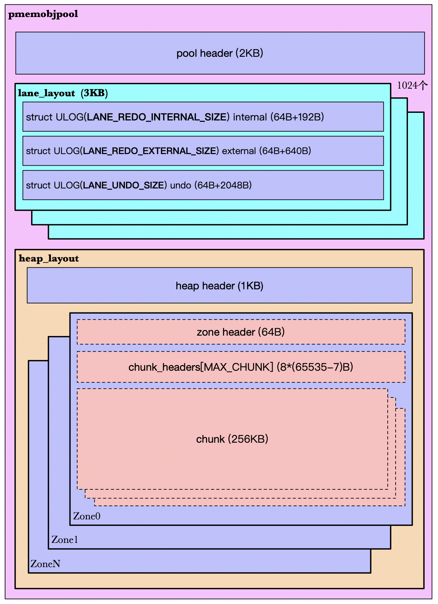

# pmemobj_pool 简介

- [1. PMDK](#1-pmdk)
- [2. libpmemobj](#2-libpmemobj)
- [3. 基本概念](#3-基本概念)
	- [3.1. 内存池（Memory pools）](#31-内存池memory-pools)
	- [3.2. 持久指针（Persistent pointers）](#32-持久指针persistent-pointers)
	- [3.3. 根对象（The root object）](#33-根对象the-root-object)
- [4. 事务接口](#4-事务接口)
- [5. Pool的空间管理](#5-pool的空间管理)

## 1. PMDK

Persistent Memory Development Kit，持久性内存开发套件，主要包含以下几个函数库：

- libpmem，提供最低级别的持久内存访问接口
- libpmemblk
- libpmemlog
- libpmemobj
- libpmempool
- ...

libpmem提供底层的内存持久化、刷新接口，其他几个库都是基于它实现的。

## 2. libpmemobj

通过`libpmempool`库，可以使用PMDK提供的内存池语义，它包含的pool的类型有：

```c
enum pmempool_pool_type {
	PMEMPOOL_POOL_TYPE_DETECT,
	PMEMPOOL_POOL_TYPE_LOG,  // pmemlog pool 
	PMEMPOOL_POOL_TYPE_BLK,  // BTT layout
	PMEMPOOL_POOL_TYPE_OBJ,  // pmemobj pool
	PMEMPOOL_POOL_TYPE_BTT,  // pmemblk pool
	PMEMPOOL_POOL_TYPE_RESERVED1, /* used to be cto */
};
```

其中obj pool是应用比较常用的，`libpmemobj`提供对象内存池的各种功能函数。

对象内存池的主要特点：

- 提供对象的语义。可以将一段持久内存空间映射为特定的struct/class
- 提供事务特性。可以使用事务接口来支持数据访问的一致性和完整性

## 3. 基本概念

### 3.1. 内存池（Memory pools）

AEP(NVM) 以DAX（直接访问）方式暴露在用户态以后，用户就可以在其中创建很多mmap文件，我们可以简单地将一个文件看成一个内存池（实际上，会复杂很多）。PMDK提供接口来自动创建文件，通常可以通过如下函数来创建一个（对象）内存池：

```c
#define pmemobj_create pmemobj_createW
PMEMobjpool *pmemobj_createW(const wchar_t *path, const wchar_t *layout,
	size_t poolsize, mode_t mode);
```

- path：创建的文件路径
- layout布局：可以理解为pool的唯一标志
- poolsize：指定pool的大小
- mode：文件读写权限

创建池时，实际上会创建一个`pool_set`，它包含同一个pool的多个副本`struct pool_replica` *replica[]。*

```c
struct pool_set {
  ...
    
	int ignore_sds;		/* don't use shutdown state */
	struct pool_replica *replica[];
};
```

然后每一个副本包含多个`部分`（part）。

```c
struct pool_replica {
	unsigned nparts;      /// part已使用的大小
	unsigned nallocated;  /// part已分配的大小？
  
  ...
    
	VEC(, struct pool_set_directory) directory;  // 数组
	struct pool_set_part part[];
};
```

一个`部分`（part）可以简单理解为一个文件。也就是说**一个pool可以包含多个文件**。

```c
struct pool_set_part {
	const char *path;
	size_t filesize;	/* aligned to page size */
	int fd;
	int flags;		/* stores flags used when opening the file, valid only if fd >= 0 */
	
  ...
  
	void *addr;		/* base address of the mapping */
	
  ...
};
```

可以看到part结构体包含很多文件的信息，其中`addr`就是该文件内存映射的起始地址。

通过函数`pmemobj_create`可以创建一个只有一个副本的pool_set，而且这个副本只有一个部分（part）。而返回的`PMEMobjpool*`指针实际上就是第一个副本的第一个部分的`addr`指针。

```c
PMEMobjpool *pop = set->replica[0]->part[0].addr;
```

### 3.2. 持久指针（Persistent pointers）

为了更方便地访问被映射的文件，PMDK使用了一种**持久化的指针**，结构如下：

```c
typedef struct pmemoid {
	uint64_t pool_uuid_lo;// 每一个pool都有一个唯一的uuid
	uint64_t off;// 对象在该pool中的偏移量
} PMEMoid;
```

持久指针可以非常简单地转化为可以直接使用的指针（**direct** pointer）：`(void *)(oid.pool_uuid_lo + oid.off)`

### 3.3. 根对象（The root object）

PMDK提供两种**遍历**内存池对象的方法：（目前了解到的）

- 从头到尾依次遍历。
- 根对象

其中，对于第一种方法，内存池对外展现的其实就是一个扁平的结构。为了更加灵活地管理内存池中对象的结构，PMDK提供**根对象**的语义。

我们可以将自己定义的的数据结构依附在这个根对象上，可以通过如下接口来分配一个根对象。

```c
PMEMoid root = pmemobj_root(pop, sizeof (struct my_root));
```

- pop：创建内存池时返回的PMEMobjpool指针
- my_root：自己定义的数据结构
- 返回值：指向根对象的持久指针

注意：一个内存池只能有一个根对象

可以**在根对象中存储指向其他对象的持久指针**，从而实现更灵活的遍历方式。

## 4. 事务接口

PMDK提供一些宏来现实事务特性。

```c
/* TX_STAGE_NONE */
 
TX_BEGIN(pop) {
	/* TX_STAGE_WORK */
} TX_ONCOMMIT {
	/* TX_STAGE_ONCOMMIT */
} TX_ONABORT {
	/* TX_STAGE_ONABORT */
} TX_FINALLY {
	/* TX_STAGE_FINALLY */
} TX_END
 
/* TX_STAGE_NONE */
```

其中，除了TX_BEGIN和TX_END是必须的之外，其他的阶段都是可选的。而且事务支持**嵌套**。

事务的主要原理：**pmdk会先将要操作的内存的一个快照（snapshot）保存在undo log中，之后应用程序可以随意修改原来的那块内存，过程中一旦出现任何失败，所有的操作就被回滚。**

## 5. Pool的空间管理

<div align=center></div>

**1. 一个pool的空间：**

- pool头部，一个，2KB
- lane_layout。包含多个，用于存储log，3*1024KB
- heap_layout。一个，用于存储数据

**2. lane_layout，用于存储log，每个3KB，共1024个**

- struct ULOG(LANE_REDO_INTERNAL_SIZE) internal (64B+192B)
- struct ULOG(LANE_REDO_EXTERNAL_SIZE) external (64B+640B)
- struct ULOG(LANE_UNDO_SIZE) undo (64B+2048B)

**3. heap_layout，pool后续全部空间**

- heap_header（堆头部），一个，1KB
- zone，多个，除了最后一个zone，大小都为MAX_SIZE，由pool所剩空间决定

**4. 一个zone包含：**

- zone_header，一个，64B
- chunk_headers[MAX_CHUNK]，chunk头部数组（数组大小为65535-7），8*(65535-7)B
- chunk，>= 1个，具体的个数由zone大小决定，每个chunk 256KB

---

**5. chunk空间由chunk_run进行管理，一个chunk_run包含：**

- 第一个chunk
  - struct chunk_run_header，头部，16B
  - Bitmap，40*8B=320B
  - 用户数据，256KB-16B-320B
- (n-1)个chunk，只用于存储用户数据

其中n的取值为1-10。chunk_run最多可以管理10个chunk，这些chunk使用一个bitmap进行管理。

**6. 对象分配**

1. chunk run按照block对空间进行管理。
2. 不同的chunk run会使用不同的block大小。
3. 分配对象时，会选择最适合的block大小进行分配。
