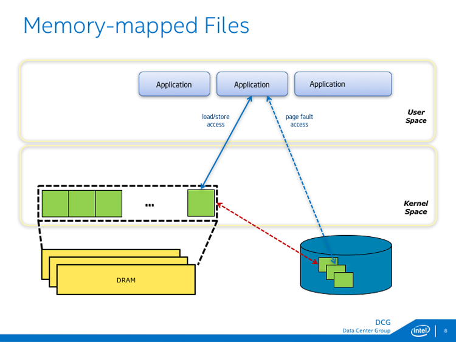
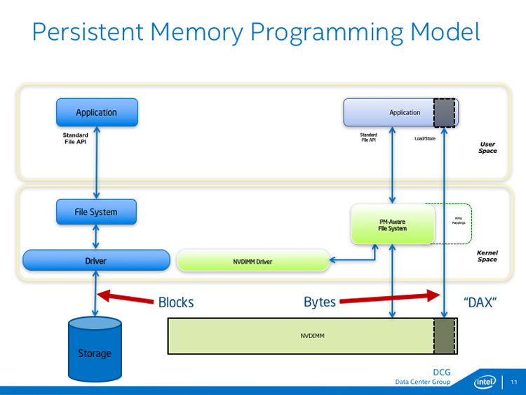

# 持久性内存编程简介

<https://software.intel.com/content/www/cn/zh/develop/articles/introduction-to-programming-with-persistent-memory-from-intel.html>

持久性内存技术支持开发兼具存储和内存属性的产品。产品具有**存储的持久性**，意味着它们将在重启后保留内容，它们可以**像内存一样按字节寻址**，意味着程序可以就地访问数据结构。

英特尔® 傲腾™ 固态盘也可以使用 3D XPoint 技术插入 PCIe 总线，从而大幅减少了访问介质的时间，**软件堆栈和 PCIe 协议的开销成为总体延迟的重要组成部分**。为了充分利用 3D XPoint 技术，必须立即着手处理软件和互联的开销问题。此时，持久性内存隆重登场。

通过**将介质连接至内存总线**，**CPU 可以直接访问数据**，不需要任何驱动程序或 PCIe 开销。由于在 64 字节高速缓存行内访问内存，因此，CPU 只读取必要部分，不会像存储那样将每次访问归拢为一个数据块大小。

借助持久性内存，应用在内存和存储层基础上新增了一个数据放置层，持久性内存层的容量超过了 DRAM，相比存储，大幅提升了速度。**应用能像使用传统内存一样，就地访问持久性内存驻留数据结构，无需在内存和存储之间反复传输数据块。**

## 内存映射

**打开文件后，内存才能映射文件**，因此，应用调用 Windows 上的 CreateFileMapping 和 MapViewOfFile 或 Linux 上的 mmap 之前，许可检查已经发生。

调用产生后，文件出现在应用的地址空间内，支持对文件内容的加载/存储访问。**存储指令引起的变化刷新至存储后，才能具有持久性**，这是内存映射文件的一个重要方面。在 Windows 上，该步骤可借助 FlushViewOfFile 和 FlushFileBuffers 完成；在 Linux 上，使用 msync 或 fsync。

持久性编程模型支持字节级访问插入内存总线的非易失性介质，此处通过常用的行业术语 `NVDIMM` 表示，它的全称是非易失性双列直插式内存模块。**映射设置完成后，您会发现应用具有 MMU 虚拟到物理映射提供的直接访问**。将这些直接映射配置到持久性内存的能力被称作**直接访问 (DAX)** 特性。普通文件系统和持久性内存感知型文件系统的不同之处在于对该特性的支持。DAX 目前受 Windows 和 Linux 支持。

