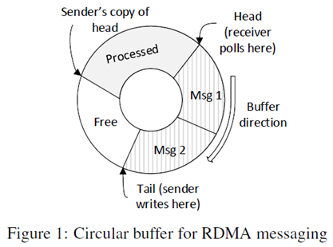
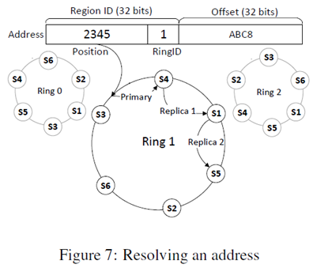

# FaRM

- [1. 相关背景](#1-相关背景)
  - [1.1. RDMA](#11-rdma)
- [2. 架构设计](#2-架构设计)
  - [2.1. 通信原语](#21-通信原语)
  - [2.2. 编程模型](#22-编程模型)
  - [2.3. 内存管理](#23-内存管理)
    - [2.3.1. 内存编码](#231-内存编码)
    - [2.3.2. 内存分配](#232-内存分配)
  - [2.4. 事务](#24-事务)
  - [2.5. 无锁操作](#25-无锁操作)

FaRM是一种分布式内存系统，它将集群中机器的内存公开为共享地址（统一编址）的空间。应用程序可以使用事务来透明地分配、读取、写入和释放地址空间中的对象。当前仅支持单个内存池。

主要的创新点：

- 无锁读取
- 支持将对象并置（即将指定对象紧挨存储）和函数传递（类似于rpc），从而启用单机事务。

对RDMA的使用方式：

- 直接访问共享地址空间中的数据（单边RDMA）
- 快速消息传递

## 1. 相关背景

### 1.1. RDMA

- 可靠的用户级别的远程内存读写
- 绕过内核
  - 避免复杂协议栈的开销
  - 仅使用远程NIC进行远程内存访问，而无需使用远程CPU

相关价格的降低。

## 2. 架构设计

FaRM将群集中所有计算机的内存公开为共享地址空间。线程可以使用具有严格可序列化性的ACID事务来分配、读取、写入和释放地址空间中的对象，而不必担心对象的位置。 FaRM提供了此简单编程模型的有效实现，该模型为大多数应用程序代码提供了足够的性能。事务使用具有优化的**两阶段提交协议**的**乐观并发控制**，该协议利用了RDMA。 FaRM通过使用复制日志记录到SSD来实现可用性和耐用性，但也可以将其（SSD）部署为缓存cache。

### 2.1. 通信原语

1. 直接数据访问：单边RDMA读取
2. 快速消息传递：RDMA写入

使用循环缓冲区实现单向通道。缓冲区存储在接收方上，每个发送方/接收方对都有一个缓冲区。

- Free：未使用
- Processed：接收方已经处理，在接收方看来该部分为未使用的全0区域，在发送方看来该部分未被处理，不能使用。发送方的head副本有延迟。
- Msg：未处理的消息

**接收方**定期轮询Head位置的单词word，以检测新消息。该单词的值表示消息的长度。消息被处理后，接收方将消息缓冲区**清零**并前进头指针。

**发送方**使用RDMA将消息写入缓冲区尾部，并在每次发送时使尾部指针前进。
它维护接收者头部指针的本地副本，并且从不写超出该点的消息。

为了防止创建大量的循环缓冲区，进行以下优化：

- 每个线程与一台机器创建一个循环缓冲区
- q个线程共享一个循环缓冲区

最终仅需要2×m×t/q个缓冲区。

由于网卡空间有限，如果页面过小，网卡将无法缓存所有页表（元信息）。从而，需要通过PCI总线从系统内存中获取页表条目。为了解决这个问题，FaRM使用**大页面**(实际为2GB)来减少NIC页表中的条目数，并为此实现了一个内核程序PhyCo。这样，FaRM注册足够多的内存区域后，网卡能缓存所有的页表。

**FaRM基于上述的通信原语，提供线程与线程（包括远程线程）之间的高效通信途径。**

### 2.2. 编程模型

基于**事件**的编程模型，所有需要轮询才能完成的操作都带有一个称为continuation的回调函数参数。continuation总是在启动操作的线程上调用。

FaRM提供将新对象存储在指定对象"相邻"位置的接口。

**要更新对象，事务必须首先读取对象，然后调用txWrite创建对象缓冲区的可写副本**。应用程序通过调用txCommit提交事务，txCommit返回结果并释放所有分配的缓冲区。事务可能由于冲突或失败而中止；否则，将执行写操作。

基于RDMA将**事务**发送到存储相关数据的机器。

### 2.3. 内存管理

#### 2.3.1. 内存编码

FaRM的共享地址空间由许多**2 GB的共享内存区域（regions）**组成，这些区域是地址映射、恢复以及RDMA在NIC上注册的单位。

**地址编码**：共享地址空间中对象的地址由32位**区域标识符**和相对于该区域开始的32位**偏移量**组成。

使用**一致性哈希**将区域标识符映射到存储对象的机器。

- **本地内存访问**：region存储对应具体机器的基址base，找到对应的机器后，就可以使用该地址访问本地内存。
- **远程内存访问**：与远程计算机联系以获得该区域的RDMA功能（相当于描述符，或者元信息，该部分信息会被缓存以提高性能），然后就可以知道该全局的地址的偏移量和对象大小，进而构建RDMA请求。

使用one-hop(单跳)分布式哈希表实现一致性哈希。将每台机器通过使用k个hash函数对它的IP地址进行散列，可以映射到k个虚拟环。即**每个虚拟环包含所有的机器，且不重复**。这样逻辑上相邻的region可能会散列到不同的机器上，实现负载均衡、（崩溃后）并行恢复数据等功能。

32位的共享区域标识符可同时标识**一个环和环中的位置**。

该区域的主版本和从副本将存储在环中位置随后的r台计算机上。图7显示了一个简单的示例，其中k = 3，r =3。根据Region ID可以定位到第二个环中的S3位置，那么该Region的主副本存储在S4，从副本存储在S1和S5，形成了三副本的结构。

这样，给定集群中的一组机器，就可以在本地执行**区域**到**机器**的映射。

**FaRM使用Zookeeper可以可靠地维护集群成员资格。**

#### 2.3.2. 内存分配

内存分配器被组织为三级层次结构（平板slabs，块blocks和区域regions），以减少同步开销（如并行分配器）。在最低级别上，线程具有**专用**的平板slabs分配器，该分配器从大块（block）中分配小对象。每个块用于分配相同大小的对象。FaRM支持256种不同的大小，从64字节到1 MB。**分配器将以适合该对象的最小尺寸的块来分配对象**。平板分配器在每个对象的标头中使用单个位来标记其已分配。

这些块是从机器范围的**块分配器**获得的，该分配器从共享内存区域分配块。它将区域划分为大小为1 MB倍数的块。每个区域都有一个表，（表中）每个块有一个8字节的分配状态。这些区域是从集群范围的**区域分配器**获得的。区域分配器使用PhyCo为该区域分配内存，然后向NIC注册该区域以允许远程访问（如第2节所述）。它通过随机选择一个环和**确保本地节点存储主副本**的环中位置来选择区域的标识符。有关区域和块分配的信息将在分配时复制。（确保数据尽量在本地申请的，这样的话，不管从逻辑还是物理上看，分配都不是连续的，只在region范围内的分配是连续的）

FaRM允许应用程序在分配对象时提供位置提示，该提示是现有对象的地址。FaRM尝试按以下顺序分配对象：在与提示**相同的块**中、在**同一区域**中、或在**同一虚拟环中具有附近位置的区域**中（即相邻的虚拟全局地址）。这样可确保即使在失败和重新配置之后，分配的对象和提示（地址）也仍然很可能同时并置（紧挨存储）在主对象和副本上。如果提示是存储在另一台服务器上的地址，则使用**RPC**执行到远程服务器的分配。

### 2.4. 事务

- 乐观并发控制
- 两阶段提交

以确保严格的可序列化性。

事务上下文记录由事务读取的所有对象的版本号（读集），由事务写入的所有对象的版本号（写集），并缓冲写操作。在提交时，运行事务的计算机充当协调器。首先向所有参与者发送准备prepare消息，这些消息是写集中对象的主副本和从副本。主副本将锁定修改后的对象，并且主副本和从副本都记录消息，然后将回复发送回去。收到所有参与者的答复后，协调器将验证validate消息发送到读取集中的主对象，以检查事务读取的版本是否最新。如果读取集验证成功，则协调器首先将提交消息发送给参与者从副本，然后再发送给参与者中的主副本。主副本更新已修改的对象并对其进行解锁，并且主副本和从副本均记录提交消息。

如果任何修改的对象被锁定、读集验证失败或协调器未能收到所有准备和验证消息的答复，则事务中止。

**优化：**

在常见情况下，FaRM提供两种机制来实现良好的性能：**单机事务和无锁只读操作**。应用程序可以通过在同一主副本和同一从副本上将事务访问的对象并置（紧挨放置），并将事务传送到主副本来使用单机事务。在这种情况下，写集锁定和读集验证是本地的。因此，不需要准备prepare消息和验证消息，并且主副本仅需要在解锁修改后的对象之前发送提交消息（给从副本），其中包含对从副本的缓冲写操作。

此外，我们使用两种锁定模式：首先将对象锁定为**允许无锁读取**的模式，而在更新对象之前（将提交消息传递到从副本之后），主对象将处于**独占模式**（也就是说，在事务启动到提交期间是可以无锁读取主副本对象的）。单机事务通过减少消息数量并进一步减少由于锁定引起的延迟来提高性能。

### 2.5. 无锁操作

FaRM提供了无锁读取，该读取可与事务进行序列化，并且使用单个RDMA读取执行，而无需使用远程CPU。

FaRM依赖于缓存一致性DMA：它在对象头部的第一个字和每个缓存行（第一个除外）的开头中都存储对象的版本号。这些版本对应用程序不可见。（空间开销大）

lockFreeRead使用RDMA读取对象，（读取后）检查标头版本是否**已解锁**并匹配所有**高速缓存行版本**。如果检查成功，则读取将严格地与事务序列化。否则，在随机退避后重试RDMA。（为什么要匹配高速缓存行？因为有可能别的线程修改了这个对象，但数据只在cache而没有刷回内存）

**在提交（写）阶段，通过首先将特殊的锁定值写入高速缓存行版本，然后更新每个高速缓存行中的数据，最后更新高速缓存行版本和标头版本（通过flush完成的吧），从而完成更新对象。**
（写按照规定的步骤进行，读也按照规定的步骤，这样就能在无锁的情况下避免读取了正在写的数据）

对象标头有个原子变量标志该对象是否被锁定。标头版本中的两个最低有效位来对锁定模式进行编码（目前只有两种锁定模式）。

**防止读取已经释放的对象**：FaRM使用128bit的胖指针，包含对象的地址、大小和预期的incarnation。incarnation用于标志对象内存重用的次数，通俗来说，刚在新的位置分配一个对象时，会在头部初始化一个值为0的incarnation，每次释放对象时，会将incarnation加一，由于FaRM是按照大小等级管理空间的，因此对于特定的位置，它总是被分配相同大小的对象，所有incarnation的数据不会被其他数据覆盖。为了防止读取已经被释放的对象，读操作完成后都会检查一次头部的incarnation值，若不匹配则读取失败。

**内存的重用**：FaRM可以重新使用释放的内存来分配相同大小的另一个对象，因为对象头中的incarnation仍然有效。为不同的对象大小重新使用内存需要更多的工作，因为对象标头可能会被任意数据覆盖。 FaRM实现了基于epoch的分配器的分布式版本。它将`end of epoch`请求发送到所有计算机上的线程（我们将消息聚合到同一计算机/从同一计算机发送）。**当线程收到此请求时，它将清除所有缓存的指针，开始一个新的纪元，并继续在新纪元中处理操作****当线程收到此请求时，它将清除所有缓存的指针，开始一个新的纪元，并继续在新纪元中处理操作**。一旦在先前时期开始的所有事务和只读操作完成，线程便发送对请求的答复。 FaRM的API提供了将操作括起来的原语，以便能够检测正在进行的操作何时完成。**在收到当前配置中所有计算机的响应后，可以重用内存**。该机制不会在很大程度上影响性能，因为它在后台运行并且仅在**可用内存降至阈值**以下时运行。
