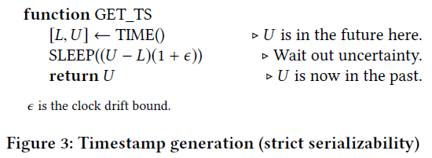

# 快速通用的不透明分布式事务

## 总体概况

FaRM的原本事务特性：**仅对已提交的事务提供严格的可序列化性**

本文扩展了FaRM的设计，以提供不透明性opacity（下文有解释），同时不降低原来系统的性能。

本文使用基于真实时间的时间戳排序，并在整个集群中将时钟同步到数10 us以内，并使用**故障转移协议**（failover protocol）来确保时钟主服务器发生故障时的正确性。

## 背景

理想的事务抽象是：开发人员将看到**一台大型机器**的抽象，该机器**按顺序运行事务**并且永不失败。

现有的分布式事务设计要么削弱了这种抽象性，要么没有实现最佳性能。

**目标**是：通过这种理想抽象来简化分布式应用程序的开发，该抽象的大型机器一次运行一个事务，并且永不失败（即同一时间能保证有一个事务是成功执行的）。

为了实现这个目标，要求分布式事务系统具有以下属性的：

1. **可串行化Serializability**：事务的最终执行结果等同于这些事务的某一串行排序的执行结果。
2. **严格性Strictness**：该排序与真实时间一致。严格可序列化，即逻辑上，先执行的提交总是先完成？
3. **快照读**：所有事务在提交或中止之前都会看到数据库的一致快照。
4. **高可用性**：系统可以从服务器故障中透明地恢复，并且停机时间**短**得足以表现为性能短暂下降。

（事务的属性/特性，补）

文章认为实现严格可序列化性对于一些应用场景是有必要的。什么是**严格可序列化性**：表示事务的序列化顺序对应于真实时间。**如果A在B开始之前完成，那么任何正确的执行都必须等同于A在B之前出现的串行执行**。即A事务中的所有操作物理上都先于B事务中的所有操作。当然前提是A和B事务存在冲突，否则就没有隔离性的必要。

**不透明性Opacity**：不论是中止的事务还是已提交的事务，都按照严格可序列化的顺序执行。比如有三个先后开始执行的事务：A、B和C，如果B因为某些条件不满足而回滚终止了，那这个条件肯定是在A执行完后的状态下，而不是在C执行完后的状态下。不透明性其实就是上面前三个属性的结合，是一个超级严格的隔离级别。

实现不透明性Opacity的常用方法：许多现有系统通过使用具有**读锁的悲观并发控制**（例如Spanner [6]），或通过**使用时间戳顺序**在执行期间提供**读快照**来提供不透明性（例如Hekaton [7，22]）。

**FaRMv1和DrTM使用乐观并发控制（OCC），为已提交的事务提供可伸缩性、可用性和严格的可序列化性，但对中止的事务提供不了这些特性**。在这些系统中乐观地执行事务可能会读取不一致的状态，这类事务最终将会被中止。无法为中止的事务提供**读快照**。（即对于中止的事务无法严格可序列化，那事务中止后，难以追溯原因？）

**乐观并发控制可以提高性能，但会给开发人员带来沉重负担**。

特别对于共享内存池系统，用户可能在其上实现各种复杂的数据结构，如链表等等，如果不能保证严格的可序列化性，可能会导致内存安全问题。
例如，**一个事务可以读取已释放和重用的内存**，这可能导致崩溃或无限循环，需要其他机制来避免这种情况。

即系统提供的隔离级别越高，一些特殊的场景下的使用就变得更简单。

> 由于开发人员无法假定不变式/约束成立，因此他们必须通过在事务代码中显式检查不变式来进行防御性编程。关系数据库通过提供在每个SQL语句之后自动检查约束的机制来减轻这种负担，但这会增加不小的性能开销，并且仍然需要开发人员编写所有相关的约束。

## 关键设计

本文设计了FaRMv2，拓展了FaRMv1以为所有事务提供**读快照**。

1. FaRMv2使用新颖的**时间戳排序协议**，该协议利用**RDMA的低延迟**来同步时钟。
   - 时间戳基于真实时间，允许机器使用其**本地时钟生成时间戳**，因此具有很好的扩展性。
   - 但是，由于时钟不能完全同步，因此在生成读写时间戳时，事务协议必须“等待不确定性”，这会引入延迟。FaRMv2利用低延迟、基于CPU的高效RDMA通信来频繁地通过网络同步时钟，以**将时钟同步误差控制在10us内**，比Spanner降低了两个数量级[6]。
   - 从集群中选出的时钟主服务器，用于时钟同步。
   - 使用时钟主机故障转移协议，可以维护时钟主服务器故障时的时间戳顺序。
2. 支持多版本，从而提高了**只读事务**的性能。

主要创新点：

1. 利用RDMA将时钟同步到数十微秒内。
2. 设计了一种不透明opacity的事务协议，它使用全局时间和单面RDMA。
3. 一种时钟故障转移协议，可在各个时钟主设备发生故障时保持时间戳有序，而无需使用诸如原子钟或GPS之类的特殊硬件。
4. 一个高效的线程局部、基于块的分配器和垃圾收集器，用于多版本。

## 系统设计

### 全局时间

时间戳顺序通过允许事务读取由读时间戳定义的一致快照来启用不透明性。
挑战在于全局地、单调地、可伸缩地生成时间戳。

使用中心服务器生成时间戳的方法无法达到目标吞吐率。

我们仅使用所有CPU上存在的周期计数器，从而使群集中的任何服务器都可以充当时钟主控器（CM），而无需其他硬件。从时钟服务使用基于RDMA写入的低延迟、CPU效率的RPC，定期将其时钟与当前时钟主服务器**同步**，实现了即使在负载的情况下，同步也只需要数十个微秒。

## FaRMv2提交协议

事务在开始执行时获取一个读时间戳，其中对于写事务会在提交时获取一个写时间戳。

FaRMv2按时间戳顺序对事务进行序列化：只读事务按其**读取时间戳**进行序列化，而读写事务按其**写入时间戳**进行序列化。

在发出第一次读取之前，CM上的时间必须超过R，以确保以后的写入都不会具有小于或等于R的时间戳。这对于不透明性是必需的。
调用start_tx时，CM上的时间也必须小于或等于R。
为了严格性起见，这是必需的，以避免读取陈旧的快照。

FaRMv2通过在调用start_tx时将R设置为时间间隔的上限，并在发出第一次读取之前**等待此间隔中的不确定性**来满足这两个条件（图3）。

应用可以设计事务的隔离级别。

### 多版本控制

多版本是使用旧版本的每个**对象**的内存中链接列表以递减的时间戳顺序实现的。

读取对象始终从头部版本开始，其位置在对象的生存期内不会改变。
这样可以确保我们始终可以使用一个单面RDMA读取头版本，而无需进行间接操作。

### 垃圾回收

内存回收按照内存块为单位，每个内存块都有一个版本，块的回收通过将它分配到特定于线程空闲块pool来实现。除非空闲块pool变得太大（此时将块释放到服务器范围的池中），否则不需要同步。

### 提前终止

事务提前终止。

对于读操作，如果发现读的是旧版本，则提前终止，因为提交的时候也会验证失败。
