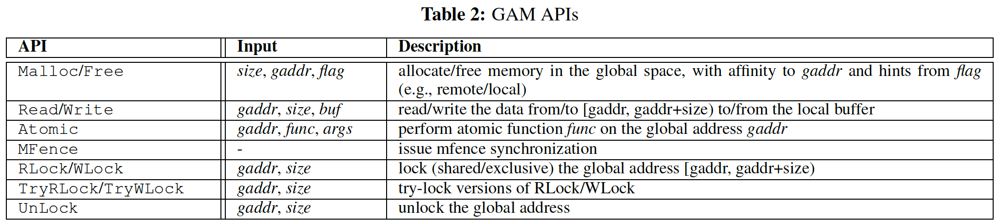

# GAM 论文简介

- [1. 背景](#1-背景)
- [2. 系统设计](#2-系统设计)
  - [2.1. 总体架构](#21-总体架构)
  - [2.2. API](#22-api)
  - [2.3. Cache一致性](#23-cache一致性)
  - [2.4. 基于LRU的Cache](#24-基于lru的cache)
  - [2.5. RDMA通信](#25-rdma通信)
    - [2.5.1. RDMA的优化](#251-rdma的优化)
  - [2.6. 内存一致性模型](#26-内存一致性模型)
  - [2.7. 事务引擎](#27-事务引擎)
  - [2.8. 小结](#28-小结)
- [3. 测试](#3-测试)
  - [3.1. Micro 基准测试](#31-micro-基准测试)
  - [3.2. 分布式事务处理](#32-分布式事务处理)

[Cai, Qingchao, et al. "Efficient distributed memory management with RDMA and caching." Proceedings of the VLDB Endowment 11.11 (2018): 1604-1617.]

GAM：带有RDMA和缓存的高效分布式内存管理系统

## 1. 背景

1. 分布式共享内存DSM的优势（相比于基于消息传递的系统，如分布式KV存储）
   - 应用可以透明地使用集群的大量内存空间
2. 传统的缓存一致性开销大
   - 利用RDMA实现高效的缓存一致性协议
3. 现有DSM系统需要手动调用特定的原语进行同步，增加开发人员的工作量
   - 提供更加友好API

## 2. 系统设计

GAM将所有节点上的内存空间统一编址为**全局共享的地址空间**。核心设计点有：

1. 采用**分区的全局地址空间寻址模型**（PGAS）
   - 每个节点负责全局地址空间的一个分区
   - 机器通过RDMA网络互连
   - 具体原理参考了其他论文（文章没有细说）
2. 基于目录（directory）的缓存一致性

### 2.1. 总体架构

1. 一个Master主机，用于系统的初始化和状态跟踪。
2. 核心模块：GAM协调器
   - 实现了Cache一致性协议
   - 协调本地和远程内存访问
   - 处理应用的请求
3. 故障恢复（比较简单）
   - 记录每个操作的Log
   - 使用NVRAM硬件，加快Log记录
   - 恢复时，反向扫描Log

### 2.2. API

GAM提供更加**灵活的**API接口，**不提供原生的事务接口**（事务可以基于提供的原生API进行封装实现）

API可以分成两类：

1. 全局内存访问（前面四个）
2. 同步（其余API接口）

对于**Malloc接口**：

- （可选）gaddr地址，用于提示系统在gaddr地址所在的节点上分配内存。类似FaRM
- （可选）flag，提示本地/远程分配
- 默认情况下，本地分配空间。
- 本地空间不足时，选择具有最大空闲内存空间的节点进行分配

通过这些简单明了的API可以很容易地在上层构建事务引擎。

### 2.3. Cache一致性

- 虽然RDMA速度很快，但远程访问和本地访问仍有10倍的性能差距。
- 利用应用程序数据访问的局部性

采用基于目录（directory）的缓存一致性

- 缓存驻留在DRAM中
- 维护元数据以跟踪每个节点的缓存情况
- 通过点对点通信保持缓存一致性

基于目录的缓存一致性协议比较复杂，这里先介绍其中几个概念，然后以一个写操作为例子，简单介绍协议的工作流程。

从数据出发，可以将节点分为以下几种类型（非互斥）：

1. **home节点（本地节点）**：数据的物理内存所在的节点
2. **远程节点**：与home节点相对
3. **请求节点**：请求获取数据的共享/独占权限的节点
4. **共享节点**：具有数据共享权限（读）的节点
5. **所有者节点**：具有数据所有权（写）的节点

初始分配数据时，home节点拥有数据，它既是共享节点也是所有者节点。此时一个远程节点请求该数据，此时可以称发起请求的节点为请求节点。当请求被回复后，根据请求数据的读/写权限，该请求节点可以提升为共享节点/所有者节点，此时请求节点的Cache上拥有该数据的副本。

> 请求数据的写权限后，数据的所有权发生转移

与硬件的缓存原理类似，GAM按照“缓存行”单元大小进行缓存，“缓存行“的大小可以配置

> 说明：下文中的缓存行若无特殊说明均指GAM系统中管理的缓存行

对于**home节点**，缓存行在目录Directory中的状态有：

- Shared（共享）
- Dirty（脏）
- Unshared（无共享）

由于网络延迟，状态之间的过渡不是原子的，因此我们为每个可能的状态过渡引入**过渡状态**（例如“SharedToDirty”）.

他们之间转换关系如下图所示：

> 初始分配数据时，数据在目录中的状态为Unshared，如果一个远程节点对该数据进行读操作，则数据的状态变成Shared；如果一个远程节点对该数据进行写操作，则数据的状态变成Dirty。

对于**远程节点**，缓存行在Cache中的状态有：

- Shared（共享）
- Dirty（脏）
- Invalid（无效）

下面以一个写请求为例，简单描述基于目录的缓存一致性协议是怎样工作的。

数据在两个节点上有Shared状态的副本，此时另外一个节点执行该数据的写操作，具体步骤如下：

1. 请求节点nr发送请求给Home节点nh（1）
2. nh节点读取该数据的目录状态，以获取该数据的共享信息（发现ns上有共享副本）（2）
3. 向共享节点ns发送`invalidate`消息，使缓存副本无效（3）
4. ns向nh回复确认消息（4）
5. ns将对应缓存行的状态设置成无效（5.1）
6. nh收到回复确认后，通过OLOG记录该数据的所有权转移情况，然后设置该缓存行的目录状态为Dirty，并在Dirty链表`dlist`上记录当前所有权节点nr（5.2）
7. nh向nr发送回复消息，并附带缓存行数据的副本（6）
8. 收到回复后，nr节点执行实际的写操作。先写DLOG，然后在Cache中修改数据，并将缓存状态修改为dirty

> 还有其他各种读写情况，具体参考论文原文，这里便不赘述

### 2.4. 基于LRU的Cache

为了减少线程竞争：

- 使用多个LRU哈希表
- 插入数据（淘汰）时，随机选择一个哈希表

> 用淘汰策略的精度换取性能

### 2.5. RDMA通信

RDMA有四种启动数据传输的动词：

1. READ
2. WRITE
3. SEND
4. RECEIVE

其中READ和WRITE是单边操作，不需要远程CPU的参与，性能要比后面两个操作（双边操作）好。对于SEND动词，需要接受方预先调用RECEIVE动词向发送方发布接收区信息。

但是，对于单边操作，远程节点没有收到任何通知，很难弄清数据的传输情况。如果使用轮询的方式，以探测操作情况，这会占用大量CPU资源。

因此，GAM基于RDMA设计了自己的通信方式，共有三种通信管道：

- 控制信息管道
- 数据传输管道
- 通知管道

所有通信方式使用RC（可靠传输）类型

1）对于*控制信息管道*，**控制信息通常比较短小，而且需要立即通知接收方**，因此它：

- 避免使用RDMA Write动词
  - 通信缓冲区需要额外的内存
  - 轮询缓冲区消耗大量CPU资源
- 只使用双边RDMA SEND/RECEIVE动词

2）对于*数据传输管道*：

- 采用单边的 RDMA WRITE

3）对于*通知管道*：

- 使用带/不带负载的 RDMA `WRITE_WITH_IMM`动词
- 对于纯通知通信，直接将信息嵌入到头部的immediate中，而没有任何负载。
- 对于需要负载的通信，**数据管道**和**通知管道**将组合在一起，以便接收方在收到数据后得到通知。

> 我们不使用 **READ 动词**，因为它的性能比WRITE [21] 差，而且很难以有效的方式保证数据的一致性 [14]，因单边通信很难通知接收方

#### 2.5.1. RDMA的优化

1）**NIC高速缓存的大小有限**。NIC通常需要存储的数据有页表、队列对和接收队列，为了减少这些数据的大小：

- **使用大页**。减少页表条目，进而减少TLB未命中。
- **一个节点内的所有线程共享一个RDMA连接**。即减少队列对数量，与FaRM类似。
- **每个节点仅使用一个共享的接收队列**。接收队列用于SEND等操作。

2）**减少CPU的开销**。

- **选择性信号**（selective signaling）技术用于完成通知。特别是，每r个RDMA动词才发送一次通知信号，从而减少了r倍的完成通知和清除例程（例如，释放send的缓冲区）的数量（不是很理解）。
- 使用**RDMA内联**技术直接通过PIO（编程输入/输出）发送较小的有效负载
  - 消除通过PCIe进行的额外DMA往返行程
  - 用于内联请求的缓冲区不需要预先注册
  - 特别有利于控制信息通道，因为其有效负载大小通常足够小以进行内联。

3）**增大请求间的共享机会**。

- 将多个小数据包合并为一个大数据包，同时保持严格的数据包顺序。

### 2.6. 内存一致性模型

首先简单介绍什么是内存一致性模型？内存一致性模型可以分为：

- 强（strong）一致性模型
  - 严格一致性
  - 顺序一致性
- 宽松（relaxed）一致性模型
  - 总体存储顺序（total store order
, TSO）
  - 部分存储一致性（partial store order, PSO）
  - 发布一致性（release consistency）

**一致性模型取决于放宽全局内存访问顺序的程度**，因为只有两种类型的内存访问：读和写，所以总共有**四种**内存访问顺序：

1. 读后读
2. 写后读
3. 读后写
4. 写后写

放宽不同的顺序导致不同的内存一致性：

- 放宽“写后读”以使读取将返回较旧的数据，这是TSO
- 进一步放宽“写后写”，则是PSO
- 允许对所有的四个内存访问顺序进行重新排序，则是发布一致性。

GAM通过放宽写后读和写后写顺序来提供**PSO一致性**，因此系统采用了大多数程序员都熟悉的**同步读**和**异步写**的编程模型。

如果想实现更高的一致性模型，可以使用相应的同步接口：

- 在每个写操作之后插入MFence，可以轻松实现**顺序一致性**
- 锁Lock原语还有助于实现应用程序级的**可序列化性**

> 这也进一步体现了GAM API的灵活性

### 2.7. 事务引擎

- 使用 TryRlock/TryWLock API来实现传统的两阶段锁 （2PL）
- 由于Cache的存在，事务涉及的所有数据都已缓存本地，减少了2PC的开销。

### 2.8. 小结

GAM的设计主要侧重于分布式层面，单机管理方面（如空间管理、垃圾回收）没有提及。主要的点有：

- 采用基于目录的缓存一致性协议缓存数据
- 采用PSO内存一致性模型
- 提供更加灵活的API，方便实现应用的各种需求
- 优化的RDMA通信

## 3. 测试

### 3.1. Micro 基准测试

- 8个节点
- 每个节点：配置50%总数据量的Cache，运行一个进程（线程）
- 测试系统：GAM（PSO）、GAM-TSO、Argo’s（暂时忽略）

着重讲一下共享比率对系统的影响。

**Sharing Ratio**：指访问的数据中，所有多少比例是在多个节点上有副本的。

测试该指标主要是观察Cache的存在，对写操作的性能的影响（下降）程度。

> 读写比例为1：1

**这里有个有趣的现象**：系统的写性能并不像想象中的那样会降低。如左图，在共享率低于20%的情况下，GAM的性能甚至提高。这是因为随着共享率的提高，共享的Cache line会因为其他节点的写操作而变为无效，从而会被淘汰出Cache，使得非共享数据的访问可以使用更多的Cache，进而提高性能。也就是说，在Cache有限（50%）、共享率较低的情况下，Cache反而是系统的瓶颈。

这个结论可以从右图中得到验证。此时系统的性能逐渐降低。

**这个测试给我们的启示是**：实际应用中，需要根据负载的情况，合理设置Cache的大小。共享率较低的情况下，可以设置更大的Cache。而在共享率较高时，设置再大的Cache也对系统性能提高不大。

### 3.2. 分布式事务处理

- 基准测试：TPC-C
- 测试系统：GAM、L-Store 、FaRM、Tell
- 公平起见：事务不能感知应用层面的数据布局
- 分布比率distribution ratio：控制一个事务中，访问其他（远程）节点数据的概率

**GAM的性能比FaRM要好**，当分布比率升高时（比如70%），两者的性能逐渐接近。这是因为TPC-C基准测试是写敏感的，这对于GAM系统来说是不友好的，当分布率升高时，为了维护缓存一致性，GAM需要更多的网络通信。

为什么GAM性能会更好，我想可以归结为两个原因：

1. 更好的通信方式，避免基于事件的编程模型，从而避免轮询造成的CPU利用率降低
2. Cache的存在，减少两阶段提交的开销。其中第二阶段可以直接本地提交。
