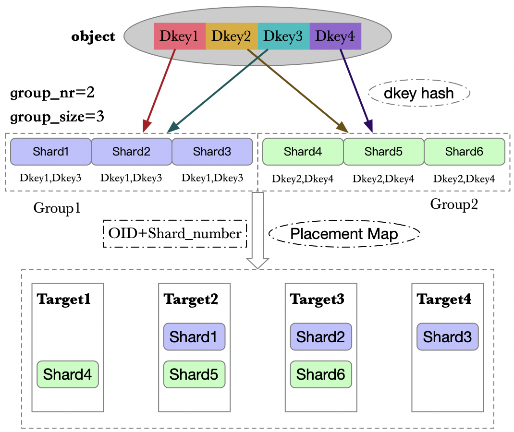

# DAOS 中的一致性哈希算法

在DAOS中，数据是按照对象来分片布局的。如下图所示。

每个对象都会与一个对象类相关联，根据对象ID的某些bit位可以找到对象类ID。对象类中会定义对象的冗余方式。如上图所示，该对象采用复制的冗余方式，对象类定义了冗余组的大小为2，组大小为3。说明该对象会分成两片，然后每一片有3个副本。所以对象共具有6个分片。

**对象的所有分片会按照顺序进行编号，然后根据对象 OID、分片编号，再结合放置映射（Placement Map）算法就可以计算出每个分片所在的 target 位置**

这里的放置映射算法实际上就是一种一致性哈希算法。目前DAOS支持两种放置映射算法：

- 环形（Ring）放置映射
- 跳跃（Jump）放置映射

