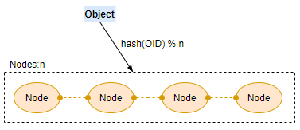
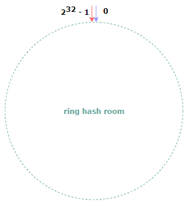
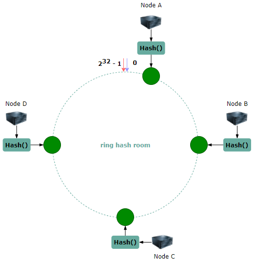
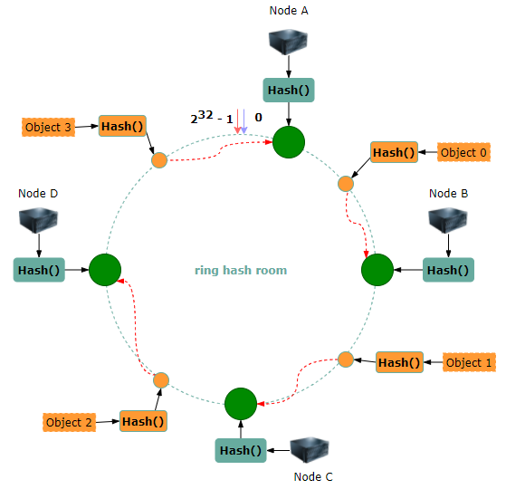
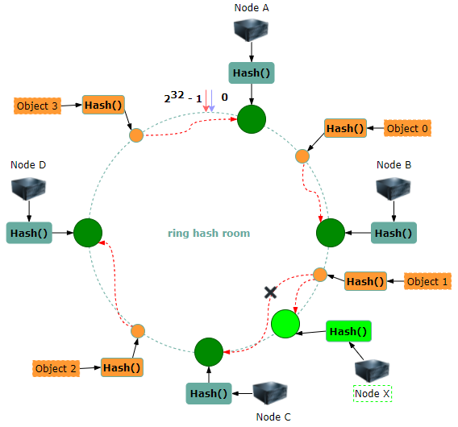
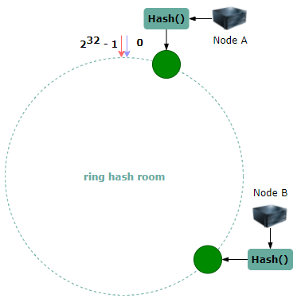
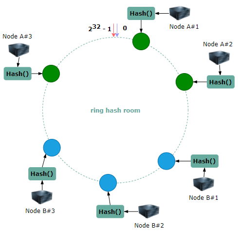

# 一致性哈希简介

## 样例背景

为了应对大规模并发访问场景，系统会将数据分散到不同的节点上进行处理，如下图所示。



集群中有n个节点，假如使用常见的哈希后取余的方法将对象分散到不同的节点。那么，当一个节点加入或者退出集群的时候，大部分对象的映射位置都会发生变化，导致整个集群的数据移动。

一致性哈希就用于解决上述的问题，最早由David Karger 等6个人发布学术论文《[Consistent hashing and random trees: distributed caching protocols for relieving hot spots on the World Wide Web](https://dl.acm.org/citation.cfm?id=258660)（一致性哈希和随机树：用于缓解万维网上热点的分布式缓存协议）》

## 一致性哈希概念

**一致性哈希**是一种特殊的哈希算法。使用一致性哈希算法后，当哈希表的存储桶数量改变时，平均只需要对其中的 K/n 个key 进行重新映射，其中 K 是 key 的数量，n 是存储桶的数量。

### 一致性哈希的特性

论文中提到良好的一致性哈希应该满足以下几个特性。其中最重要的是前面两个特性。

1. 平衡性(Balance)/均匀性

平衡性是指哈希的结果能将数据均匀地分布到所有的存储桶上。即key映射到每个存储桶的概率是相等的。

很多哈希算法都能够满足这一条件。

2. 单调性(Monotonicity)/一致性

单调性是指如果已经有一些数据通过哈希分布到存储桶中，然后又有新的存储桶加入，那么当存在一些key需要调整映射位置时，它们只能映射到新加入的存储桶，而不会被映射到原有的其他存储桶中。

也就是说，在重新映射的过程中，key要么保留在原来的存储桶中，要么移动到新加入的存储桶。

3. 分散性(Spread)
4. 负载(Load)

这两个是分布式cache场景中的特性。

5. 平滑性(Smoothness)

平滑性是指存储桶的数量平滑改变和key映射位置的平滑改变是一致的。

> 当存储桶的数量平滑改变时，数据的迁移也是平滑的，而不会造成大规模的数据迁移。

## Ring Consistent Hash

环形一致性哈希（Ring Consistent Hash）将整个哈希值空间组织成一个虚拟的圆环，这里假设某个哈希函数H的值空间为0-2<sup>32</sup>-1。整个哈希空间按照顺时针方向从小到大组织。



然后，将集群中的每个节点进行哈希，具体可以选择服务器ip或者主机名作为关键字进行哈希，这样就可以确定每个服务器节点在哈希环上的位置。这里假设有四个节点，如下图所示。



接下来，使用如下算法定位数据所在的节点：将数据key使用相同的函数Hash计算哈希值，该哈希值对应到环上的一个位置，从该位置沿环顺时针“遍历”，第一个遇到的节点就是该数据所在的位置。下图展示了四个对象所在节点的计算过程。



根据上述的算法，对象0会被定位到节点B。

下面分析节点退出和加入的情况。假设Node C宕机了，按照前面所说的数据定位过程，只有对象1受影响，它被重新定位到定位到Node D。一般地，如果一个节点退出系统，那么只有该节点到环空间的上一个节点（沿逆时针找到的第一个节点）之间的数据需要重新定位，其他数据不受影响。

如果在集群中增加一个Node X，如下图所示。



此时也只有对象1需要重新定位到Node X，其他节点不受影响。

综上，当节点的加入或删除时，系统都只用重新定位一小部分数据。

### 节点数较少时的数据均衡

另外，一致性哈希算法在节点太少时，容易因为节点分部不均匀而造成数据倾斜的问题。例如系统中只有两个节点，它们在环上的分布如下。



此时会导致大量的数据定位在Node A，而只有少量数据定位在Node B的数据倾斜问题。

一致性哈希算法引入了虚拟节点的机制，即对于每个节点计算多个哈希值，每个计算结果上都放置一个该节点，称为虚拟节点。具体的做法可以在节点ip或者主机名后增加编号来实现。例如上面的情况，可以为每台服务器计算三个虚拟节点，于是可以分别计算 “Node A#1”、“Node A#2”、“Node A#3”和“Node B#1”、“Node B#2”、“Node B#3”的哈希值，于是形成六个虚拟节点。



然后，使用同样的数据定位方法，只是多一步从虚拟节点到实际节点的映射，例如定位到“Node A#1”、“Node A#2”、“Node A#3”三个虚拟节点的数据均定位到Node A上。这样就解决了服务节点太少时数据倾斜的问题。

### 算法复杂度分析

节点数量：N
Key数量：K

**空间复杂度**：O(N)。需要使用一个链表来保存所有节点的信息。

**时间复杂度**：

|               | Classic hash table | Ring consistent hash |
| ------------- | ------------------ | ----------------------- |
| add a node    | O(K)               | O(K/N + logN)           |
| remove a node | O(K)               | O(K/N + logN)           |
| add a key     | O(1)               | O(logN)                 |
| remove a key  | O(1)               | O(logN)                 |

添加一个节点时，传统哈希算法需要将全部key重新映射，而一致性哈希只需要重新映射K/N的key，但需要二分查找重新映射的节点，所以还需要额外的logN时间复杂度。

添加一个key时，传统的哈希算法只需要O(1)的时间复杂度，但一致性哈希算法需要O(logN)的时间复杂度，这也是因为需要二分查找key所在的节点。

可见，环形一致性哈希算法减少了系统扩容或者缩容时，重新映射的key的数量；但却增加了单个key的查找时间。所以一致性哈希一般应用于分布式等节点数量会变化的场景。

### Jump Consistent Hash

Jump一致性哈希是谷歌的John Lamping和Eric Veach在论文《[A Fast, Minimal Memory, Consistent Hash Algorithm](https://arxiv.org/pdf/1406.2294.pdf)》提出的一种一致性哈希算法。相比于传统的环形一致性算法，这个算法的厉害之处在于：

- 零内存开销
- 算法简洁（C++的实现不到10行代码）

下面是完整的算法：

```cpp
int32_t JumpConsistentHash(uint64_t key, int32_t num_buckets) {
    int64_t b = ­1, j = 0;
    while (j < num_buckets) {
        b = j;
        key = key * 2862933555777941757ULL + 1;
        j = (b + 1) * (double(1LL << 31) / double((key >> 33) + 1));
    }
    return b;
}
```

论文中的论证过程比较复杂，这里参考知乎上的一片文章：[jump consistent hash的逻辑详解](https://zhuanlan.zhihu.com/p/104124045)，来简单说明这个算法为什么具有一致性和均衡性。

#### 构造一个满足一致性的哈希算法

一致性要求：当增加新桶时，原有桶中的key要么保留在原有的桶中，要么移动到新增的这个桶中。

假设一致性哈希函数为 $ch(key,n)$ ，其中 $key$ 为要放入元素的键值，$n$ 为桶的个数，函数的返回值是给 $key$ 分配的桶 $id$（从0开始），返回值的范围为 $[0,n-1]$。那么根据“一致性”的要求，有如下的递推公式：


根据这个递推公式，我们就可以很方便实现满足一致性的哈希算法。如下的C++代码。

```cpp
unsigned int ch(unsigned int key, unsigned int n)
{
    srand(key);
    unsigned int id = 0;
    unsigned int fence = rand();
    while (n > fence)
    {
        id = fence;
        fence = id + rand();
    }
    return id;
}
```

这个算法的核心思想是：生成一个大于桶数的随机数，当桶的数量增加时，判断当前桶的数量n是否超过这个随机数，如果超过，则将key移动到新桶，否则保留在原来的桶中。

算法中使用key作为随机数种子，所以一旦key和n确定了，函数的返回值也就是确定的。

下面用一个简单的过程分析，以更好地理解这个算法：

- 当n=1时，不管生成的随机数是多少，函数的返回值都为0。同时假设此时生成的随机数为3
- 当n=2, 3时，因为随机数种子不变，所以开始生成的随机数fence也是3，这个时候函数的返回值id仍然是0
- 当n=4时，因为随机数种子不变，开始fence=3，所以n>fence，进入循环中。进入循环后id=3，并假设生成的新fence=3+5=8。此时n<新生成的fence，跳出循环返回id=3
- 当n=5, 6, 7, 8时，因为因为随机数种子不变，开始fence=3，所以n>fence，进入循环中。进入循环后id=3，新生成的fence=8。此时n=新生成的fence，跳出循环返回id=3
- 当n=9时，前面都是重复n=5, 6, 7, 8的步骤。在最后一步时，因为n=9，fence=8，满足n>fence，会再次进入循环，此时id=8，假设新生成fence=8+2=10。此时会跳出循环返回id=8
- ...

可以看到，该算法符合上述的递推公式，满足一致性。

#### 调整算法，满足均匀性

均匀性是指key映射到所有存储桶的概率相等。显然前面给出的算法是不满足均匀性的。

若要实现均匀性，实际上，只需要满足一个条件：

1. 当桶的个数从n增加到n+1，所有key移动到新桶的概率为 1/(n+1)。

可以用**数学归纳法**来证明。

首先，对n=1、2、3这些特殊情况进行说明：

- 首先，当桶总数n=1时，key分配到第0个桶中的概率是1
- 新增一个桶，此时n=2，key被分配到新桶（第1个桶）中的概率是1/2，保留在原桶中的概率也是1/2，满足均匀性
- 再新增一个桶，此时n=3，key被分配到新桶（第2个桶）中的概率是1/3，保留原桶（第0或1个桶）中的概率是1/2 * 2/3 = 1/3

更一般的情况：

- 当n=k时，key被分配到每个桶中的概率是1/n
- 再新增一个桶，此时n=k+1，key被分配到新桶（第k个桶）中的概率是1/(k+1)，保留原桶（第0或1或……或k-1个桶）中的概率是1/k * k/(k+1) = 1/(k+1)。此时key被分配到每个桶的概率仍然为 1/n

为了让前面的算法满足均匀性，需要对随机数的生成方式进行修改，论文中生成随机数的方法为：假设 key 上一次跳变的桶 id 是 b ，也就是有 ch(key,b+1)=b ，那么生成的随机数 f=(b+1)/r，其中 r 是 (0,1) 范围内的均匀的随机浮点数。由这个随机数 f 按照方法2中的思路，来决定接下当桶数增加时， key 留在原桶还是移动到新桶中。

下面只需要证明，当桶数从b+1增加到b+2时，key移动到新桶的概率为 1/(b+2) 即可。证明如下：

1. 根据算法，当桶数从b+1增加到b+2时，key若要保留在原来桶中，则有 f>=b+2
2. 由于 f=(b+1)r
3. 因此P(f>=b+2) = P((b+1)/r > b+2) = P(r<=(b+1)/(b+2))
4. 由于 r 是 (0,1) 范围内的均匀随机数
5. 所以 P(f>=b+2) = (b+1)/(b+2)
6. 所以key移动到新桶的概率为 1-(b+1)/(b+2) = 1/(b+2)

所以，前面的代码可以修改如下。

```cpp
int ch(int key, int n)
{
    random.seed(key);
    int b = 0;
    int f = 0;
    while (f < n)
    {
        b = f;
        r = random.next();
        f = floor((b+1)/r)
    }
    return b;
}
```

对比论文中给出的算法。

```cpp
int32_t JumpConsistentHash(uint64_t key, int32_t num_buckets) {
    int64_t b = 1, j = 0;
    while (j < num_buckets) {
        b = j;
        key = key * 2862933555777941757ULL + 1;
        j = (b + 1) * (double(1LL << 31) / double((key >> 33) + 1));
    }
    return b;
}
```

论文将浮点随机数生成器换成了**64位的线性同余随机数生成器**。其中对于(double(1LL << 31) / double((key >> 33) + 1))，分子的最大值为 0x8000 0000，分母的最大值为 0x0FFF FFFF + 1 = 0x8000 0000，所以(double(1LL << 31) / double((key >> 33) + 1))的最小值为1，所以生成的随机数也是单调递增的。

#### 算法复杂度分析

空间复杂度为O(1)

对于时间复杂读，可以假设上述算法中的r每次都取0.5，则可以认为每次 f=2*f，所以时间复杂度为O(log(n))。

#### 缺点

和传统的环形一致性哈希相比，这个算法有两个缺点：

1. 不支持设置哈希桶的权重
2. 仅能在末尾增加和删除桶，不能删除中间的哈希桶

解决办法：增加一层**虚拟桶**，使用Jump consistent hash来将 key 分配到虚拟桶中，然后在虚拟桶和实际桶之间建立一个映射关系。这样我们就可以通过映射关系来设置每个实际桶的权重；也可以在任意位置删除和添加实际桶，只需要维护好映射关系即可。当然，这样做的代价就是，算法本来可以的无内存占用的，现在需要有一块内存来维护映射关系了。

## 参考

1. 维基百科-Consistent hashing: <https://en.wikipedia.org/wiki/Consistent_hashing>
2. 一致性Hash算法背景：<https://www.cnblogs.com/williamjie/p/9477852.html>（介绍了一个环形映射的例子）
3. jump consistent hash的逻辑详解：<https://zhuanlan.zhihu.com/p/104124045>